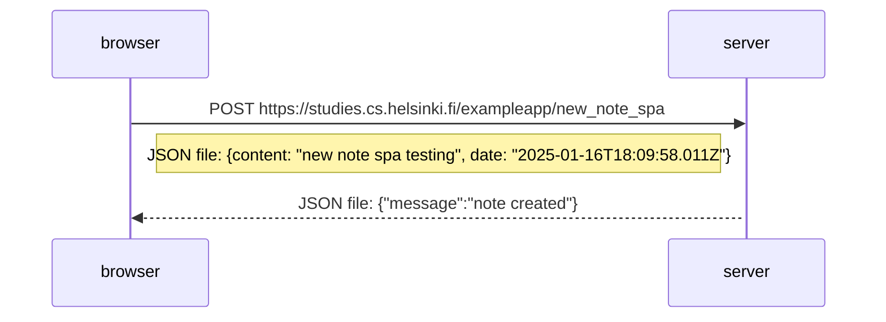

```mermaid
sequenceDiagram
    participant browser
    participant server

    browser->>server: POST https://studies.cs.helsinki.fi/exampleapp/new_note_spa
    Note right of browser: JSON file: {content: "new note spa testing", date: "2025-01-16T18:09:58.011Z"}

    activate server
    server-->>browser: JSON file: {"message":"note created"}
```
